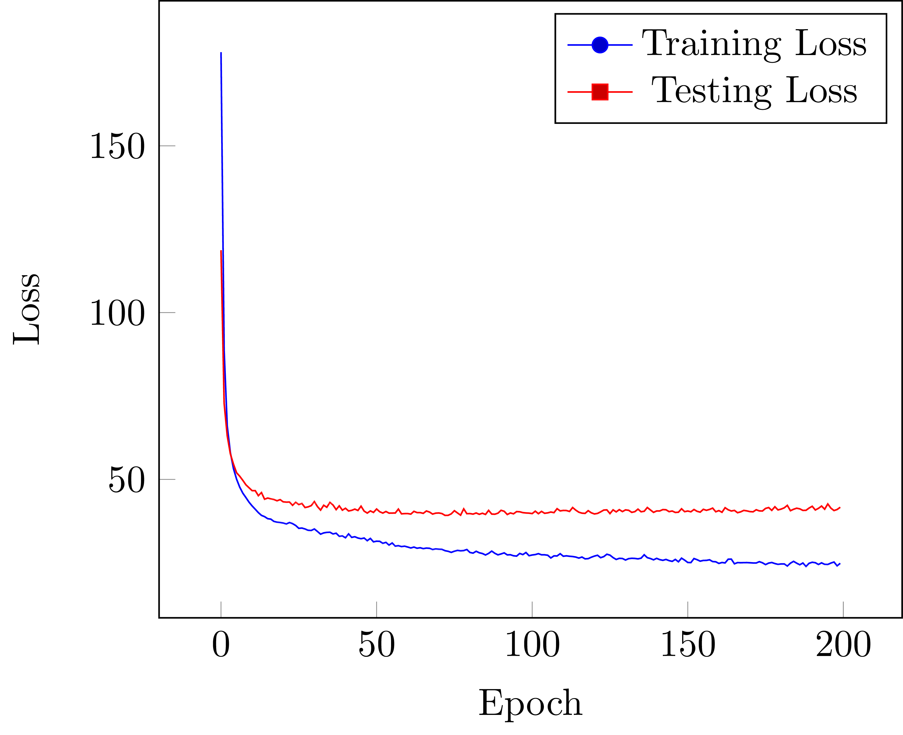
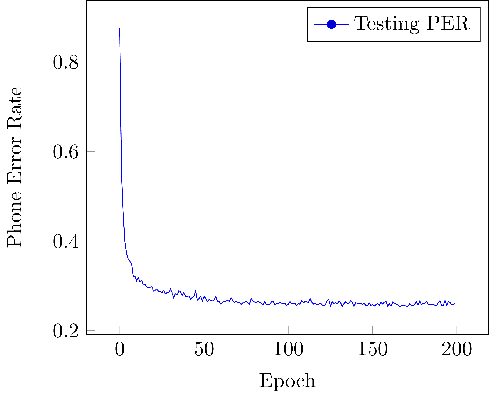

# tensorflow-wavenet

## Overview
The repository contains the source code of **end-to-end automatic speech recognition system** based on [WaveNet][WaveNet] and [Connectionist Temporal Classification][CTC] (CTC), which is implemented by Tensorflow. Moreover, we use TIMIT for training and evaluation.

## Usage
1. Prepare the TIMIT dataset, and preprocess it with the instructions in [timit-preprocessor][timit-preprocessor].
2. Run `python train.py --train_feat TRAIN_SCP --teain_label TRAIN_LBL --valid [VALID_SCP VALID_LBL]`. There are many parameters to be tuned in WaveNet, so feel free to tune it on your own.

Note: `TRAIN_SCP` is in Kaldi format and `TRAIN_LBL` looks like the following structure:
```
dr4-mkcl0-sx281 h#,k,ao,r,iy,ih,n,dcl,t,r,ih,sh,pcl,p,l,ey,dcl,t,ae,gcl,w,ax,th,bcl,b,iy,tcl,ch,bcl,b,ao,l,z,f,axr,aw,axr,z,h#
dr4-mkcl0-sx11 h#,hh,iy,w,el,ax,l,aw,q,ax,r,eh,r,l,ay,h#
...
UTTERANCE_NAME SEQUENCE_OF_PHONES
...
```

## Performance
It is hard to re-produce the result in original paper because of the obscure parameter settings and architecture. However, the best result after tuning (using MFCC as inputs and CTC loss) is shown as follows:

 


We can see that the best phone error rate on 39 phones set is around 25%, where the setting is in the following:
- residual_channels: 16
- dilation_channels: 32
- skip_channels: 16
- num_residual_blocks: 4
- num_dilation_layers: 5
- batch_size: 4
- 39-dimension MFCC (13 + delta + delta-delta)
- without causal layer

Compared with BiLSTM, the WaveNet architecture can achieve the comparable result but comsume less time.

## References
- [kaldi_io][kaldi_io]
- [timit-preprocessor][timit-preprocessor]
- [WaveNet][WaveNet]
- [Connectionist Temporal Classification][CTC]
- [Speech-To-Text-WaveNet][STTW]

## Contact
Issues and pull requests are welcomed. Feel free to [contact me](mailto:windqaq@gmail.com) if there's any problem.

[kaldi_io]: https://github.com/vesis84/kaldi-io-for-python
[timit-preprocessor]: https://github.com/Jy-Liu/timit-preprocessor
[WaveNet]: https://deepmind.com/blog/wavenet-generative-model-raw-audio/
[CTC]: https://mediatum.ub.tum.de/doc/1292048/341531.pdf
[STTW]: https://github.com/buriburisuri/speech-to-text-wavenet
